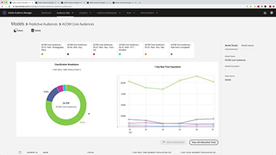

# Tutoriels Audience Manager

Bienvenue sur le site dédié aux tutoriels Audience Manager. L’utilisation de ces tutoriels et de la [documentation](https://experienceleague.adobe.com/docs/audience-manager/user-guide/aam-home.html) vous permet de mieux comprendre comment utiliser Adobe Audience Manager pour créer et activer des audiences sur n’importe quel canal ou appareil à l’aide des meilleures [!DNL data management platform] d’Adobe.

* **Sélection du personnel** met en avant certains de nos contenus préférés
* Explorez le contenu par sujet et sous-sujet dans le **volet de navigation de gauche**
* Utilisez le champ **recherche** en haut de la page si vous savez ce que vous recherchez

## Sélection du personnel

<table>
<tr>
  <td>
    
    

      <a href="https://experienceleague.adobe.com/docs/platform-learn/implement-web-sdk/overview.html?lang=fr">
    <strong> Tutoriel sur l’implémentation de Adobe Experience Cloud avec Web SDK </strong>
    </a>
    

    

    <em>Découvrez comment implémenter des applications Experience Cloud à l’aide de Adobe Experience Platform Web SDK.</em>
    

  </td>
  <td>
    
    

      <a href="https://experienceleague.adobe.com/docs/audience-manager-learn/tutorials/other-integrations/integrating-with-rtcdp/rtcdp-segments-for-aam-users.html">
    <strong>Présentation des segments dans Real-time CDP pour les utilisateurs Audience Manager</strong>
    </a>
    

    

    <em>Cette vidéo examine les différences de création de segments et de segments entre Audience Manager et Real-time CDP.</em>
    

  </td>
  <td>
    
    

      <a href="https://experienceleague.adobe.com/docs/audience-manager-learn/tutorials/build-and-manage-audiences/algorithmic-models/configure-and-report-on-predictive-audiences.html">
    <strong>Configuration et création de rapports sur les audiences prédictives dans Audience Manager</strong>
    </a>
    

    

    <em>Dans cette vidéo, nous allons découvrir la configuration des audiences prédictives dans l’interface d’Audience Manager.</em>
    

  </td>
</tr>
</table>

